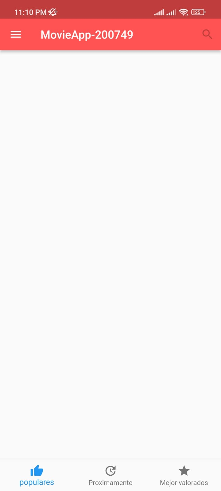
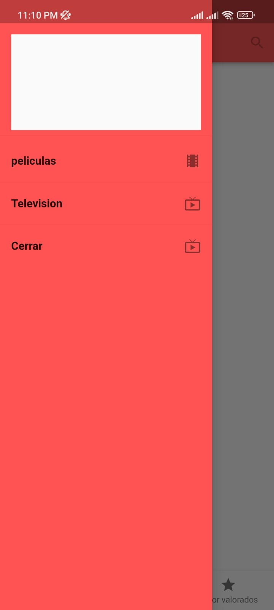

# DMI_PRACTICA7_200749

  
# Universidad Tecnológica de Xicotepec de Juárez

## Ingeniería en Desarrollo y Gestión de Software

## Desarrollo Movil Integral

## Marco Antonio Rosas Gonzalez
 
## 10° "A"

## Septiempre - Diciembre

## Descripcion:"MovieAPP" representa la puerta de entrada definitiva al apasionante mundo del cine y la televisión desde la comodidad de tu dispositivo móvil. Gracias a su robusta plataforma desarrollada en Flutter, esta aplicación te permite explorar un vasto y siempre creciente catálogo de películas, series de televisión y contenido audiovisual de primera categoría. Con "MovieAPP" puedes sumergirte en la experiencia completa, obteniendo detalles exhaustivos sobre cada título y fechas de lanzamiento. Además, la aplicación ofrece una integración perfecta con tus servicios de transmisión favoritos, lo que te permite disfrutar de películas y episodios directamente desde la aplicación. No importa si eres un amante del cine o un apasionado de las series de televisión, "MovieAPP" te ofrece una experiencia personalizada al permitirte crear y gestionar listas de reproducción adaptadas a tus gustos. La interfaz de usuario elegante y fácil de navegar garantiza que tu experiencia sea intuitiva y satisfactoria. En resumen, "MovieAPP" es tu compañero esencial para explorar, descubrir y disfrutar del fascinante mundo del entretenimiento audiovisual. Descarga la aplicación hoy mismo y sumérgete en una aventura cinematográfica y televisiva sin límites.

&nbsp;
&nbsp;

&nbsp;
&nbsp;

 
 